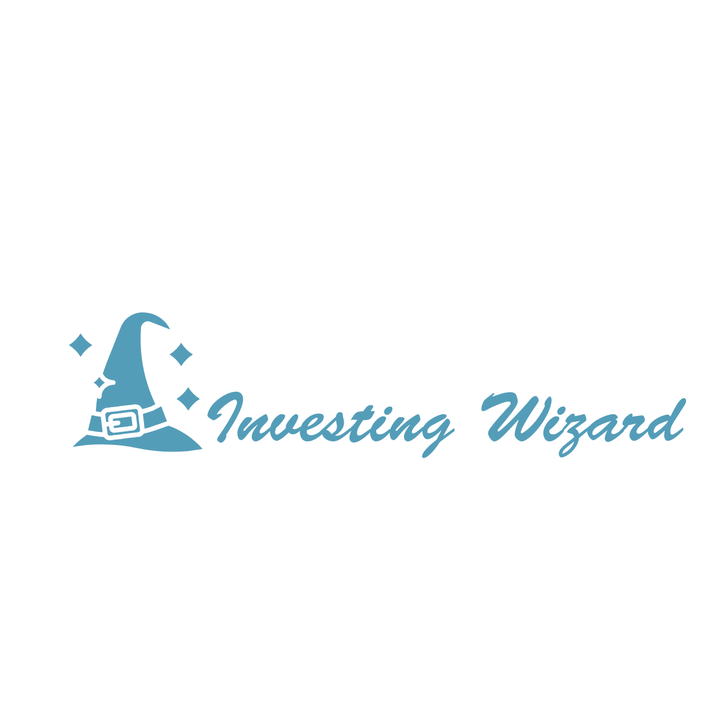
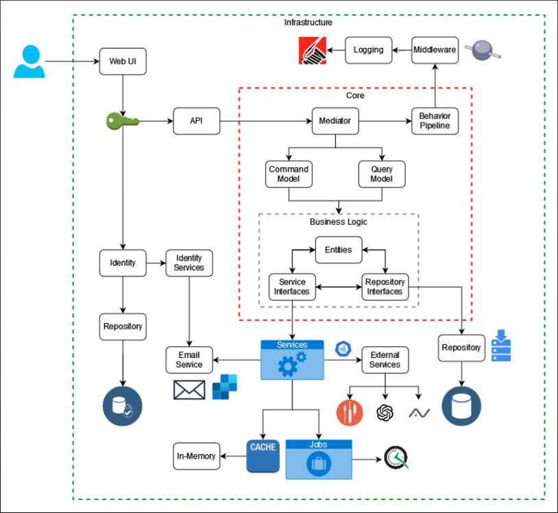

  

               

# Investing Wizard

**Investing Wizard** is an intelligent financial platform designed to help investors consolidate, analyze, and optimize their portfolios.

Built on a modern .NET stack and structured around Clean Architecture principles, the app combines real-time market data, advanced tax optimization tailored to Romanian laws, and AI-driven features to simplify investment tracking and decision-making.

Whether you're investing through Romanian or international brokers, this platform can act as a **central hub** where all your financial activity is unified, visualized, and enhanced.

---

## A unified platform for real investors

Unlike typical investment trackers, *Investing Wizard* goes beyond basic charts and average returns.

Here’s what it really offers:

- **A single control center for your investments**, regardless of the broker. The system distinguishes between local (Romanian tax-resident) and foreign brokers and applies fiscal logic accordingly.
- **Historical transaction-level tracking**, not just holdings, to compute precise net profit, dividend returns, and average buy/sell values in real time.
- **Tax-loss harvesting** and custom optimization logic based on Romanian tax laws. If you invest through non-resident brokers, the platform helps you minimize taxes via techniques that go far beyond simple recordkeeping.
- **Smart assistant modules** powered by AI. Get financial news summaries, market sentiment breakdowns, and helpful recommendations with context-aware responses.
- **Currency unification**: All your transactions and returns are normalized in RON, using up-to-date FX rates.
- **Blazing-fast performance and secure architecture**, thanks to .NET 8, Blazor Server, PostgreSQL, and MediatR.

## Looking ahead — simulations and predictions

Because the app already stores historical data for thousands of assets (via EODHD APIs), it opens the door to more than just analysis, **it becomes a testing ground for machine learning**:

- You can simulate buying a stock at any moment in the past and calculate its performance in today's terms.
- You can train predictive models using long-term historical price data, then test those models against more recent data to evaluate accuracy.
- These capabilities make *Investing Wizard* ideal for future AI/ML integration focused on forecasting, backtesting, and decision support.

## See it in action

## Tech Stack Overview

| Layer           | Stack / Tools Used                           |
|-----------------|----------------------------------------------|
| Web UI          | Blazor Server, Syncfusion UI, Bootstrap      |
| Backend         | ASP.NET Core 8, CQRS with MediatR, DDD       |
| Database        | PostgreSQL + Entity Framework Core           |
| Caching & Jobs  | IMemoryCache, Quartz.NET                     |
| Logging         | Serilog (structured + request tracing)       |
| AI / News       | OpenAI, Alpha Vantage APIs                   |
| Market Data     | EODHD (Real-time, Historical, Fundamentals)  |
| Email + Auth    | ASP.NET Identity, SendGrid, QR-based 2FA     |

## Architecture Overview

  

## Documentation & License

Originally developed as a BSc graduation project by **Apostol Horia-Andrei** in 2024,  
this project originated as a bachelor’s thesis at *"Alexandru Ioan Cuza" University in Iași*.

Download full academic PDF (in Romanian): [InvestingWizard.pdf](docs/InvestingWizard.pdf)
